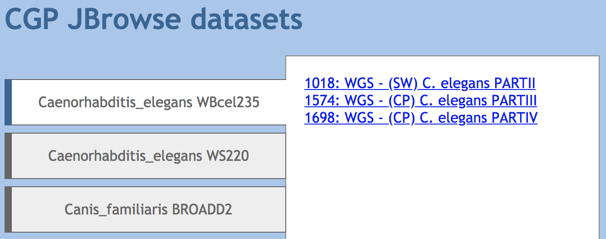

# ensembl-to-jbrowse

Scripts to automagically create a JBrowse instance from an Ensembl FTP URL, by @keiranmraine.

A product of [GCC/BOSC 2018 CollaborationFest](https://galaxyproject.org/events/gccbosc2018/collaboration/)

:warning: This is known to work on the variants of JBrowse __*before*__ the webpack conversion.  Modification will be requied for JBrowse v1.13.0+.

<!-- TOC depthFrom:2 -->

- [Scripts](#scripts)
    - [ensemblToJbrowse.pl](#ensembltojbrowsepl)
    - [buildJbrowseIndex.pl](#buildjbrowseindexpl)
- [Installation](#installation)
    - [Dependencies](#dependencies)
    - [Scripts](#scripts-1)
        - [System install](#system-install)
        - [Prefix install](#prefix-install)
    - [Minimal build images](#minimal-build-images)

<!-- /TOC -->

## Scripts

Scripts included here are inteded to aid setup of new species from the Ensembl FTP servers.

Please see commmand line help (`-h`, `--help`) for arguments.

### ensemblToJbrowse.pl

This script takes a FTP url for the DNA FASTA folder of the species of interest and path or URL to a `jbrowse.zip` release archive from jbrowse.org.

The Ensembl URL should be of the form:

```
ftp://ftp.ensembl.org/pub/release-$RELEASE_NUM/fasta/$SPECIES/dna/
```

Technically EnsemblGenomes should also work, but milage may vary due to some inconsitancy in file naming:

```
ftp://ftp.ensemblgenomes.org/pub/release-39/bacteria//fasta/bacteria_91_collection/escherichia_coli/dna/
```

:information_source: This has to be ftp to allow listing of the content.

### buildJbrowseIndex.pl

This script builds an index page of species/build deliniated datasouce lists by interrogatings the
`jbrowse_conf.json` file within the jbrowse deployment.  It is intended to be used on configurations
setup using the `ensemblToJbrowse.pl` script, but will work for any deploymens of the form:

```
*/*/JBrowse/jbrowse_conf.json
```

The resulting index is placed in the root of the area and would look something like this:



:information_source: This will onyl work if you have populated the `jbrowse_conf.json` for the individual
deployment folders.

## Installation

### Dependencies

You will need to install the following tools and ensure they are available on path:

* samtools

### Scripts

Use cpanm to install the package to your prefered location.

#### System install

```
cpanm install https://github.com/GMOD/ensembl-to-jbrowse/archive/master.tar.gz
```

#### Prefix install

```
cpanm install -l $PREFIX_PATH https://github.com/GMOD/ensembl-to-jbrowse/archive/master.tar.gz
```

### Minimal build images

If you want to build this on a minimal system for docker or otherwise without `wget` add the `--no-wget` option to the `cpanm` command.


